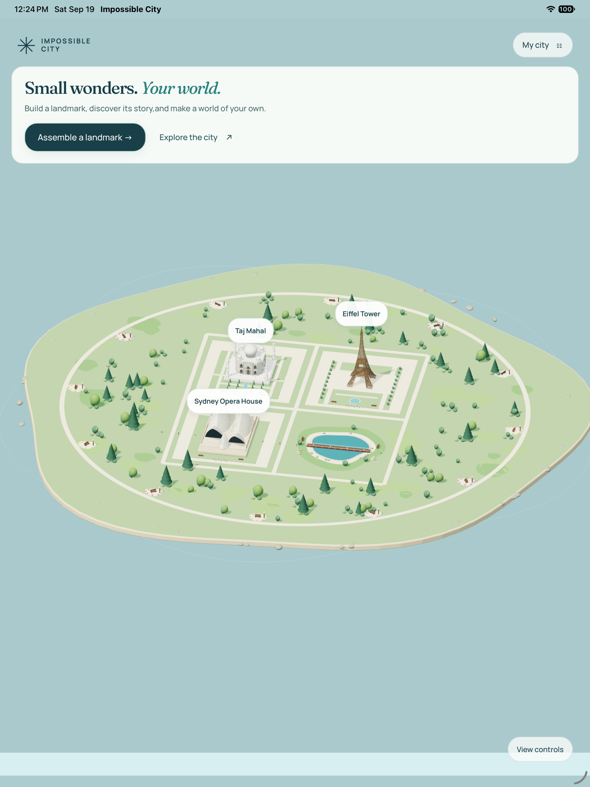
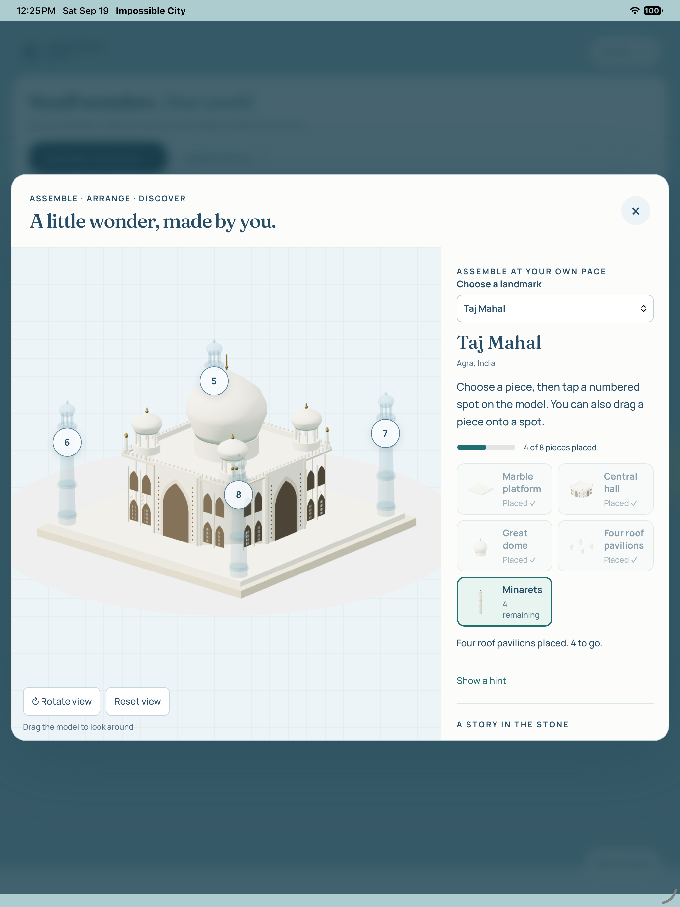
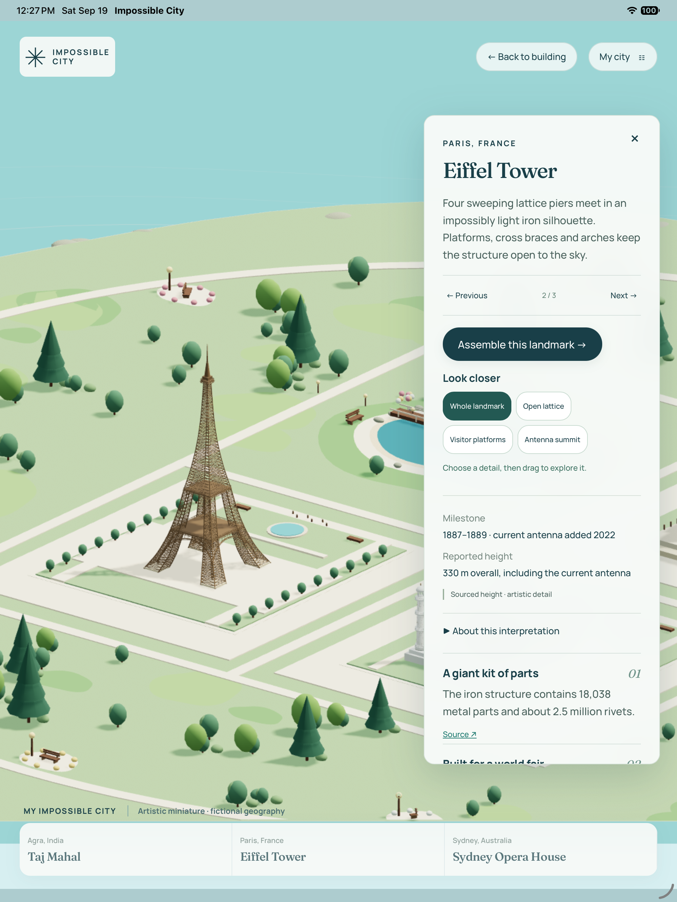

# Impossible City

### Build wonders. Make your world.

A quiet place to assemble architectural miniatures, discover their stories, and create a city of your own.

**iPad · iPhone · Mac · In development**

[Free and Pro](#start-with-three-wonders) · [Privacy](PRIVACY.md) · [Support](SUPPORT.md)

Impossible City is being prepared for the Apple App Store. **It is not available to download or purchase yet.** This repository is its public product and support page. The app source is private; no app binaries are distributed here.

## Start with three wonders

| Free | Pro — Edition One |
|---|---|
| Taj Mahal, Eiffel Tower, Sydney Opera House | Everything in Free, plus six landmarks |
| Eight-section assembly activities | Leaning Tower of Pisa and Elizabeth Tower |
| Name and arrange your own imaginary city | Temple of Heaven and Itsukushima Torii |
| Sourced stories and close-up views | Brandenburg Gate and Space Needle |
| Local progress and city saves | Assembly, stories and views for each added landmark |

The intended launch offer is a free download with a **US $6.99 one-time Pro purchase**, with no subscription. Apple will display regional pricing when the purchase is available. Edition One includes the six additional landmarks above; future editions are separate.

There is no timer. Build at your own pace, move a finished miniature into your city, and discover something about the place that inspired it. Models are artistic interpretations; puzzle sections do not represent historical construction sequences.

## A look inside

Actual iPad simulator captures of the development candidate:

<table><tr><td></td><td></td><td></td></tr><tr><td>Your own city</td><td>Build a wonder</td><td>Discover its story</td></tr></table>

## Made for your device

The app targets iOS/iPadOS 26 and macOS 26 or later, with a native Mac app. Game assets and stories are included. There is no game account, advertising or analytics SDK. Purchases, restoration and external historical sources require internet access.

City saves stay on each device and do not sync with the website or other devices. Shared Pro ownership across the Apple versions is planned through the same Apple Account; final store configuration and validation are pending. Web and Android purchase sharing are not offered.

## Release status

Free and Pro are implemented in a development candidate. Final testing, store configuration and App Review are pending. The App Store link will appear after approval and release. There are no public downloads yet.

## Support and feedback

See [Support](SUPPORT.md) or [open an issue](https://github.com/pstarwars2026/impossible-city/issues/new/choose). Keep personal information and purchase receipts out of public issues.

[Privacy policy](PRIVACY.md) · [Credits](CREDITS.md)

Copyright © 2026 Parashar Shah. Impossible City is proprietary software. This product page does not grant a license to the app source code. Third-party components retain their respective licenses.
